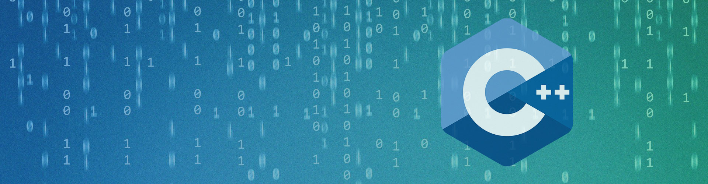

# 👨‍💻 C++ 개발자 - isho

  

안녕하세요! 저는 효율적이고 안정적이며 고성능 애플리케이션을 구축하는 데 전념하는 C++ 개발자 **isho**입니다.

깔끔한 코드, 논리적인 문제 해결, 그리고 현대적인 C++ 개발에서의 지속적인 학습을 추구합니다.

## 🛠️ 기술 스택

### **Language::핵심 언어**  

  

- **C++**: 고성능 시스템 프로그래밍, 게임 엔진 개발, 메모리 관리
- **C**: 시스템 레벨 프로그래밍, 임베디드 시스템, 성능 최적화

### **Database::데이터베이스 및 캐싱**  

  

- **MySQL/MariaDB**: 관계형 데이터베이스 설계, 쿼리 최적화, 데이터 모델링
- **Redis**: 캐싱, 세션 관리, 실시간 데이터 처리

### **Network::네트워크 프로그래밍**  
- **TCP/UDP 소켓**: 클라이언트-서버 구조, 멀티플레이 동기화
- **비동기 I/O**: epoll, IOCP 기반 이벤트 기반 서버 개발
- **리눅스 시스템**: 서버 환경 구축 및 성능 최적화

### **Ide::개발 도구**  
- **CLion**: C++ 통합 개발 환경, 디버깅, 프로파일링
- **VS Code**: 크로스 플랫폼 개발, 확장 기능 활용

### **Version::버전 관리**  
- **Git**: 분산 버전 관리, 브랜치 전략, 코드 리뷰
- **GitHub**: 오픈소스 기여, 프로젝트 관리, 협업

## 📊 GitHub 분석

  
  

## 🌱 기여 그래프

  

## 🎯 현재 집중 분야

- **C++ 심화**: 메모리 관리, STL, 멀티스레딩 & 동기화
- **네트워크 프로그래밍**: TCP/UDP 소켓, 비동기 I/O, 이벤트 기반 서버
- **서버 아키텍처**: 게임 로직 분리, 샤드, 로비, 매치메이킹
- **데이터베이스 연동**: MySQL, Redis 캐싱 및 영속성 관리
- **알고리즘 & 성능 최적화**: O(N), O(log N) 최적화 감각

---

## 🚀 주요 프로젝트

### 📚 알고리즘 & 코딩 테스트
- **백준 온라인 저지**: 1000+ 문제 해결
- **프로그래머스**: 레벨 3 달성
- **LeetCode**: 자료구조/알고리즘 능력 향상

### 🖥️ 서버 개발 프로젝트
- **멀티플레이 게임 서버**: 채팅 + 미니게임 동시 접속 서버 구현
- **고성능 데이터 처리 시스템**: 멀티스레딩 및 메모리 최적화
- **DB 연동 시스템**: 캐릭터/아이템/점수 관리, 캐싱 최적화

### 🎮 게임 개발 경험
- **2D 게임 엔진**: C++ 기반의 간단한 게임 엔진 개발
- **물리 엔진**: 충돌 감지 및 물리 시뮬레이션 구현
- **실시간 멀티플레이**: 동기화 기법 및 트래픽 최적화

---

## 📫 연락처

새로운 기회나 협업에 대해 이야기하고 싶으시다면 언제든 연락주세요!

  
  
  
  
    
  
  

